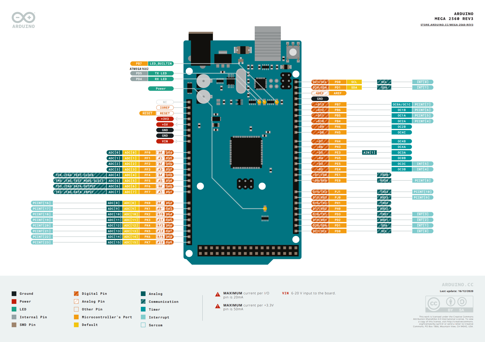
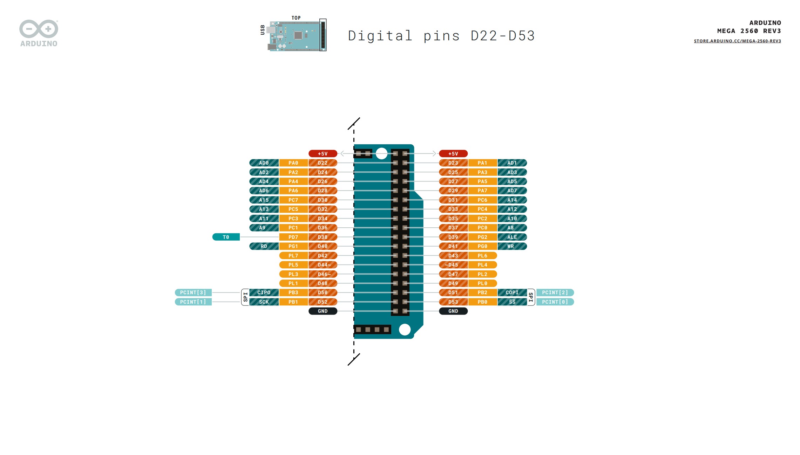
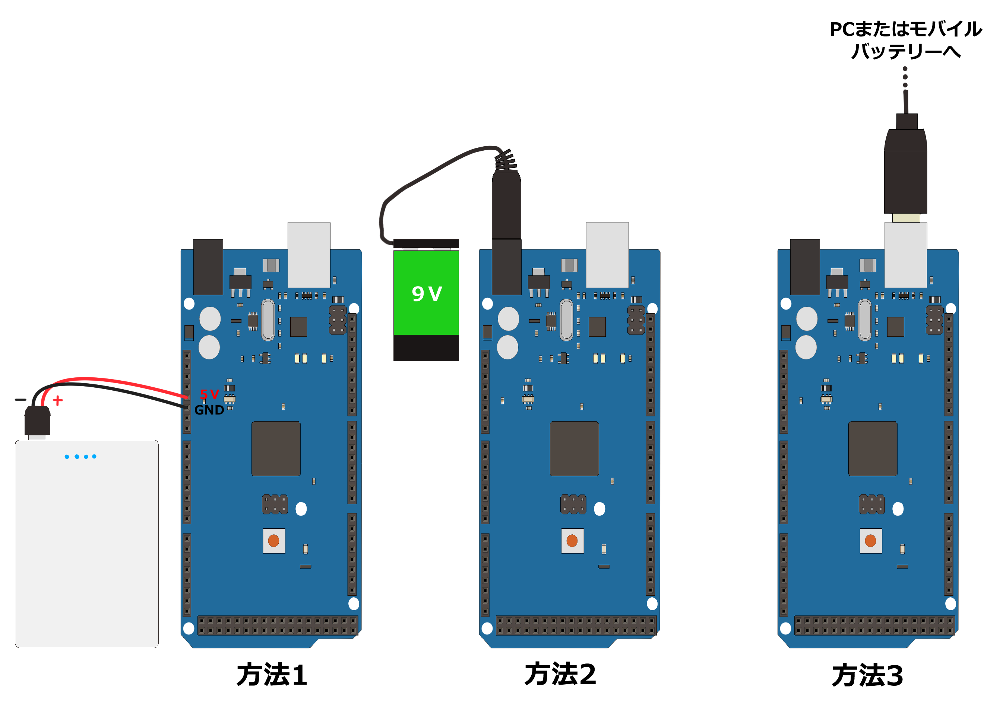

# Arduino_Mega2560を知る

Arduino Mega2560の使い方を調べていきましょう。
「Arduino Mega2560 ピン配置」で検索すると、この様なピン配置が載った図が見つかります。

出典：「Pinout-Mega2560rev3_latest.pdf」（ARDUINO CC）より引用
https://content.arduino.cc/assets/Pinout-Mega2560rev3_latest.pdf

## 主要ピンの説明

### GND (Ground)

回路の基準となる0Vの端子です。電源のマイナス側にあたります。

部品を動かすときは、電源側のGNDとマイコン側のGNDを必ず繋いでおく必要があります。GNDが繋がっていないと電圧の基準がずれてしまい、センサーの値がおかしくなったり、モーターが正しく動かなかったり、最悪の場合は部品が壊れる原因にもなります。
Mega2560の基板上にはGNDピンが何箇所もありますが、内部ですべて繋がっているので、配線しやすい場所を自由に使って構いません。
電池・バッテリー・USB電源などを使うときも、それぞれのマイナス端子(-)がGNDにあたります。複数の電源を使う回路(例: モーター用電源とマイコン用電源を分けている場合)では、電源同士のGNDも繋いでおくのを忘れないようにしましょう。

### 5V

5Vの電源を出力する端子です。

センサーやモジュールを動かすための電源として使います。多くのモジュールは動作電圧が5Vなので、まず最初に候補になる電源ピンです。
Mega2560はUSBまたはDCジャックから電源をもらい、内部のレギュレータで安定した5Vを作ってこのピンから出力しています。あまり大電流を必要とする部品を直接繋ぐと電圧が不安定になったりマイコンが不安定になるので、そうした部品は別の電源(バッテリーなど)を使い、GNDだけ共通にするのが基本です。

### 3.3V

3.3Vの電源を出力する端子です。

5Vをかけると壊れてしまう3.3V駆動の部品に使います。使う部品のデータシートで動作電圧が3.3Vと書かれていたら、必ずこちらを使ってください。

### Digital Pin(デジタルピン)

LOW(0V)かHIGH(5V)の2値だけを扱うピンです。

出力として使うときは、LEDの点灯・消灯やモーターのON/OFFなど「つける/消す」の制御に使います。
入力として使うときは、スイッチが押されたかどうかなど「2つの状態のどちらか」を読み取るのに使います。
`pinMode()`で入力(INPUT)か出力(OUTPUT)かを最初に設定してから、`digitalWrite()`(出力)や`digitalRead()`(入力)で使います。

### D\*\* (例: D2, D13)

デジタルピンの番号です。

「D」の後ろの数字がピン番号を表し、D13から信号を出力させたいときは、プログラムでは`digitalWrite(13, HIGH)`のように番号を指定して使います。
Mega2560にはD0〜D53まで54本のデジタルピンがあり、その一部がPWMやUART・I2Cなど特別な機能を兼ねています。

### PWM

Digital Pinの中でも基板上に「~」マークが付いているピン(Mega2560では2〜13、44〜46番)はPWM出力に対応しています。

ON/OFFを高速に繰り返す時間の割合(デューティ比)を変えることで、擬似的にアナログ電圧のような出力を作れます。
モーターの速度調整やLEDの明るさ調整によく使われ、プログラムでは`analogWrite(9, 128)`のように0〜255の値で指定します。
あくまで「高速なON/OFFの繰り返し」であって、本物のアナログ電圧を出力しているわけではない点に注意してください。

### Analog Pin(アナログピン)

0〜5Vの範囲の電圧を細かい数値(0〜1023)として読み取れるピンです。

可変抵抗(ボリューム)や光センサー、温度センサーなど、連続的に変化する値を扱うセンサーの入力によく使います。
Digital Pinと違い、入出力の設定(`pinMode`)は不要で、`analogRead()`を呼ぶだけで読み取れます。

### A\*\* (例: A0, A1)

アナログピンの番号です。

プログラムでは`analogRead(A0)`のように指定します。Mega2560にはA0〜A15の16本のアナログ入力ピンがあります。

### I2C

I2C(Inter-Integrated Circuit)は、2本の配線で複数のセンサー・モジュールを同時に接続できるシリアル通信方式です。

- **SCL (Serial Clock)**: タイミングを合わせるためのクロック信号を送る端子です。
- **SDA (Serial Data)**: 実際のデータを送受信する端子です。

この2本をセットで使い、各デバイスに割り当てられた固有のアドレスで通信相手を区別します。UARTのように機器の数だけ配線を増やす必要がなく、SCL・SDAの2本だけで多数のセンサーをまとめて接続できるのがI2Cの特徴です。

### UART

UART(Universal Asynchronous Receiver/Transmitter)は、2本の配線で1対1のシリアル通信を行う方式です。

- **TX (Transmit)**: データを送信する端子です。
- **RX (Receive)**: データを受信する端子です。

自分のTXを相手のRXに、自分のRXを相手のTXに繋ぐのが基本の配線です。パソコンとのシリアルモニタ通信や、GPS・Bluetoothモジュールなどとのやり取りによく使われます。I2Cと違い1対1専用の通信方式なので、送信側と受信側で通信速度(ボーレート)を揃えておく必要があります。Mega2560にはSerial〜Serial3まで4系統のUARTがあり、それぞれ専用のTX/RXピンを持っています(例: Serial0は0番/1番ピン)。複数のUART機器を同時に使いたいときに便利です。

!!! warning "0番・1番ピン(Serial0)を使うときの注意点"

    0番(RX0)・1番(TX0)ピンは、パソコンとのUSBシリアル通信(スケッチの書き込みやシリアルモニタ)にも使われているSerial0と共通です。ここに別の部品を繋いでしまうと、書き込みやシリアルモニタが正しく動かなくなることがあるため、他の用途にはSerial1〜Serial3(19/18番、17/16番、15/14番)を使うようにしましょう。

## 電源のつなぎ方

Arduino Mega2560への電源供給の方法は主に3つあります。

- **方法1** は5VピンとGNDピンをそれぞれバッテリーの+極と-極に繋ぐ方法です。5Vピンはマイコン内部の電源ラインに直接つながっているので、マイコンを動作させられます。

- **方法2** はDCジャックに7~12Vの電源を繋ぐ方法です。基板内のレギュレーターが5Vに変換するため、電源電圧が多少下がっても安定して動作するのが利点です。ただし、この電源端子には5V電源を繋いでも動作しないので注意してください。

- **方法3** はUSBを繋いでPCかバッテリーから給電する方法です。プログラムの書き込みにもUSBを使うので、1本で書き込みと電源供給を完結できます。

## 演習

- 上のピン配置画像をブラウザから探してみてください。
- 気になったピンについて調べてみるのもおすすめです。