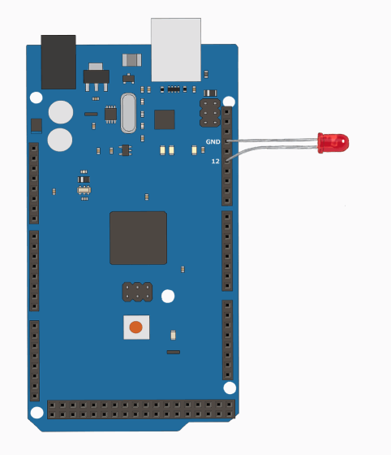

# PWM

PWM(Pulse Width Modulation)を使って、LEDの明るさを滑らかに変化させてみましょう。

[Arduino_Mega2560を知る](../Arduino_Mega2560を知る.md)でも触れた通り、Mega2560で基板上に「~」マークが付いているピン(2〜13番、44〜46番)はPWM出力に対応しています。今回はデジタル信号のときと同じ12番ピンを使います。

```cpp
void setup() {
    Serial.begin(9600); //通信速度の初期化
    pinMode(12, OUTPUT); //12番ピンを出力モードに設定
}

void loop() {
    for (int value = 0; value <= 254; value++) { //0から254まで1ずつ明るくする
        analogWrite(12, value);
        delay(4);
    }
    for (int value = 255; value >= 1; value--) { //255から1まで1ずつ暗くする
        analogWrite(12, value);
        delay(4);
    }
}
```

実機の動作イメージです。



!!! warning "本来はLEDの間に抵抗を入れてください。でないと高電圧でLEDが壊れます。"

上のコードでは`value`を0から254まで1ずつ増やしながら`analogWrite(12, value)`を実行し、続けて255から1まで1ずつ減らしながら実行しています。合計510回の`analogWrite()`をそれぞれ`delay(4)`(4ミリ秒)を挟んで実行するので、明るく→暗くの1周が約2秒(510×4ミリ秒)になります。

`analogWrite()`は指定したピンにPWM信号を出力する関数で、0(常にLOW)〜255(常にHIGH)の範囲で明るさを指定できます。

#### 使用したコード

- [analogWrite(pin, value)](https://www.musashinodenpa.com/arduino/ref/index.php?f=0&pos=2145)
- [for](https://www.musashinodenpa.com/arduino/ref/index.php?f=0&pos=149)
