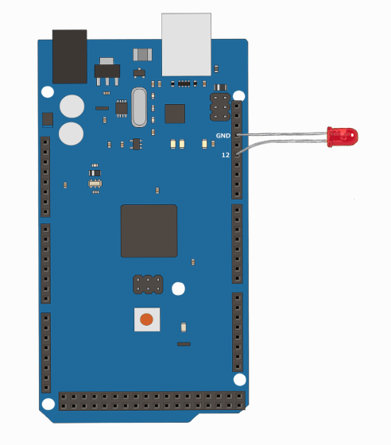

# デジタル信号

Digital Pinを使用して特定のピンから電気を流し、LEDをチカチカさせてみましょう。

[Arduino_Mega2560を知る](../Arduino_Mega2560を知る.md)でも触れた通り、Mega2560にはD0〜D53まで54本のDigital Pinがあり、基本的にはどのピンでも`pinMode()`・`digitalWrite()`で使うことができます。

ただし、次のピンは他の用途と兼用になっているので、それらを使う予定がある場合は避けておくと安全です。

- **2〜13番、44〜46番**: PWM出力にも使えるピンです。
- **20番・21番**: I2C通信(SDA・SCL)と共通です。センサーなどでI2Cを使う予定があるなら、別のピンを使いましょう。

```cpp
void setup() {
    Serial.begin(9600); //通信速度の初期化
    pinMode(12, OUTPUT); //12番ピンを出力モードに設定
}

void loop() {
    digitalWrite(12, HIGH); //12番ピンをHIGH(5V)にする
    Serial.println("LED点灯");
    delay(1000); //1000ミリ秒(1秒)待つ

    digitalWrite(12, LOW); //12番ピンをLOW(0V)にする
    Serial.println("LED消灯");
    delay(1000); //1000ミリ秒(1秒)待つ
}
```

このコードは次のように出力されます。

```
LED点灯
LED消灯
LED点灯
LED消灯
LED点灯
LED消灯
.
.
.
```

実機の動作イメージです。



!!! warning "本来はLEDの間に抵抗を入れてください。でないと高電圧でLEDが壊れます。"

`pinMode()`で12番ピンを出力(OUTPUT)モードに設定してから、`digitalWrite()`でHIGH(5V)・LOW(0V)を切り替えることでLEDの点灯・消灯を制御しています。`delay()`はミリ秒単位で処理を止める関数で、`delay(1000)`と書くと1000ミリ秒(1秒)待ちます。

## 演習

13番ピンを使って、点灯1秒→消灯2秒を繰り返すプログラムに書き換えてください。**検証ボタン**でコンパイルが通るか確認しましょう。

??? tip "組み立て方(答えを見る前に)"

    1から書き直すのではなく、上のコードのどこを直せばよいかを探します。問題文を分けると、変える所は2種類です。

    | 問題文 | どこを直すか |
    | --- | --- |
    | 13番ピンを使って | `pinMode()`と`digitalWrite()`の中の`12`を`13`にする(3か所) |
    | 点灯1秒 | 点灯のあとの`delay(1000)`はそのまま |
    | 消灯2秒 | 消灯のあとの`delay()`を`2000`にする |

    `delay()`はミリ秒で指定するので、2秒は2000です。ピン番号の書き換えは1か所でも忘れると動かないので、`12`が残っていないか確認しましょう。

??? success "答えを見る"

    ```cpp
    void setup() {
        Serial.begin(9600); //通信速度の初期化
        pinMode(13, OUTPUT); //13番ピンを出力モードに設定
    }

    void loop() {
        digitalWrite(13, HIGH); //13番ピンをHIGH(5V)にする
        Serial.println("LED点灯");
        delay(1000); //1秒待つ

        digitalWrite(13, LOW); //13番ピンをLOW(0V)にする
        Serial.println("LED消灯");
        delay(2000); //2秒待つ
    }
    ```

    変えたのは、`pinMode()`と`digitalWrite()`のピン番号を12から13にした所と、消灯側の`delay()`を2000にした所の2つです。


#### 使用したコード

- [pinMode(pin, mode)](https://www.musashinodenpa.com/arduino/ref/index.php?f=0&pos=2010)
- [digitalWrite(pin, value)](https://www.musashinodenpa.com/arduino/ref/index.php?f=0&pos=2045)
- [delay(ms)](https://www.musashinodenpa.com/arduino/ref/index.php?f=0&pos=2582)
