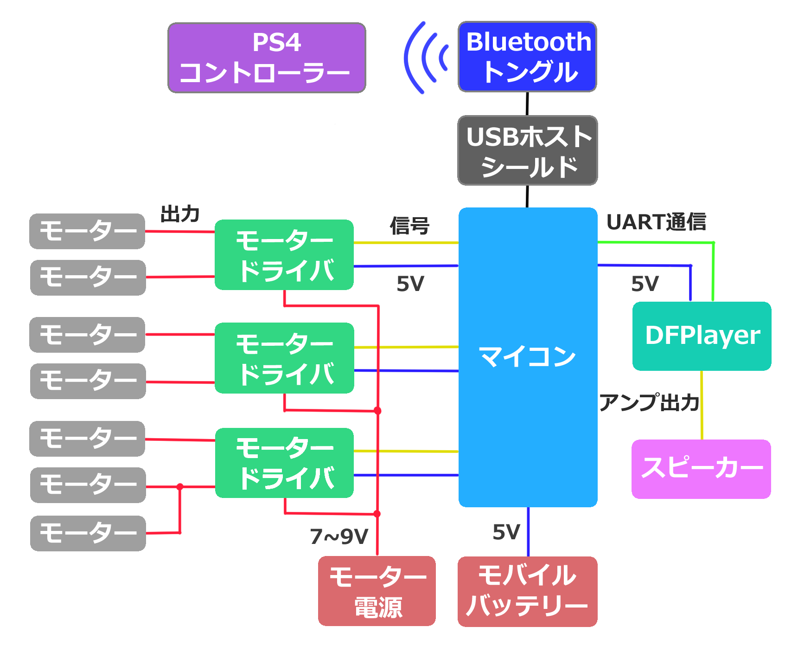

# 全体像を知る

まずは今回ロボットで動かす回路構成を説明します。

モーター4つで移動し、残り3つはボールの射出機構用に使います。モータードライバは1つにつき2つのモーターを個別に制御できるので3つだけ使用します。バッテリーはモーター用とマイコン周辺用の2つを使用します。DFPlayerを使って音を鳴らします。マイコンの上に乗った増設回路から、Bluetoothを介してPS4コントローラーで操作します。

ここから詳細な部品の選定をしていきましょう。

## モーター

モータードライバに必要な性能を決めるために、まずモーターを決めていきます。

サカロボで使うモーターは6~9V DCギアボックスモーター(だったと思います)。1つあたり最大0.3A流れると想定します。

## モータードライバ

モータードライバは、マイコンの信号だけでは動かせないモーターに必要な電圧・電流を供給し、駆動させるための回路(IC・モジュール)です。マイコンのピン出力はごくわずかな電流しか流せないため、モーターを直接繋ぐとマイコンが壊れてしまいます。モータードライバを間に挟むことで、マイコンからの小さな信号でモーターの正転・逆転・速度を安全に制御できます。

先ほど6~9V・0.3Aのモーターを使うとしました。回路図を見ると、1つのモータードライバでこのモーターを最大3つ動かすので、9V以上・0.9A以上に耐えられるモータードライバを探します。部活には赤いモータードライバと青いモータードライバがありますが、どちらも35V・2Aまで対応しているので、どちらかを使います。

## マイクロコントローラ

マイクロコントローラ（マイコン）はプログラムを実行する為の重要な演算装置です。

マイコンにはいろいろな種類があり、それぞれ得意なことが違います。代表的なものを紹介します。

| マイコン | 特徴 |
| --- | --- |
| Arduino Uno | ATmega328P搭載、動作クロック16MHz。Digital14本・Analog6本とMega2560よりピン数は少ないが、情報や解説記事が最も多い定番の入門機。 |
| Arduino Nano | Unoと同じATmega328P・16MHzのチップを、ブレッドボードに挿せる小型基板にまとめたもの。省スペースにしたい場合はこちら。 |
| Arduino Mega2560 | ATmega2560搭載、動作クロック16MHz。Digital54本(PWM15本)・Analog16本、UART4系統とUno・Nanoよりピン数が大幅に多く、大きめの回路向け。 |
| ESP32 | Xtensaデュアルコアで最大240MHzとMega2560よりかなり高速。Wi-Fi・Bluetoothを標準搭載し、無線通信が手軽にできる。 |
| ESP32-C3 | シングルコアのRISC-V、最大160MHz。無印ESP32より廉価・省電力寄りの構成で、ピン数・性能も控えめ。 |
| ESP32-S3 | Xtensaデュアルコア、最大240MHz。USB OTGやAI処理向けの命令を追加した上位モデル。性能はS3が最も高性能。 |
| Raspberry Pi Pico | RP2040(デュアルコアArm Cortex-M0+)搭載、クロック133MHz。Arduinoシリーズより高速・低価格で、MicroPythonでも開発できる。無線機能は非搭載。 |
| Raspberry Pi Pico W | 無印PicoにWi-Fi・Bluetoothを追加したモデル。チップ・クロックは同じ。 |
| Raspberry Pi Pico 2 | RP2350(デュアルコアArm Cortex-M33)搭載、クロック150MHz。無印よりRAM・Flashも増量し処理も高速。無線機能は非搭載。 |
| Raspberry Pi Pico 2 W | Pico 2にWi-Fi・Bluetoothを追加したモデル。性能はPico/Pico WよりPico 2/Pico 2 Wの方が明らかに高い。 |
| STM32 | ARM Cortex-M系32bitマイコン。Arduinoシリーズよりさらに高クロック・多機能(シリーズにより32MHz〜480MHz超)だが、開発環境の準備がやや複雑。 |

PS4コントローラーを使いたいので、Bluetoothを追加できるマイコンであればどれでも良いのですが、サカロボではArduino Mega2560を使用します。

## DFPlayer

DFPlayer Mini(DFPlayer)は、microSDカードに入れた音声ファイル(mp3など)を再生できる小さな音声再生モジュールです。マイコンとはUARTで接続し、「◯番のファイルを再生して」「音量を上げて」といった命令をシリアル通信で送るだけで音を鳴らせます。今回はこのDFPlayerを使って、得点時や動作時などの効果音を鳴らします。

## スピーカー

DFPlayerのアンプ出力は3Wまでのスピーカーに対応しています。間に抵抗を挟めば1Wのスピーカーも鳴らせます。部活にある中から適したスピーカーを探しましょう。

## USBホストシールド

USBホストシールドは、本来USB機器を繋ぐ側(ホスト)になれないArduinoに、USB機器を接続できるようにするための拡張基板(シールド)です。Mega2560のUSB端子はパソコンとの通信用(USBデバイス側)のため、そのままではUSB機器を挿しても認識できません。USBホストシールドをマイコンの上に重ねて使うことで、USB機器を接続できるようになります。今回は、この後説明するBluetoothドングルを挿すために使用します。

## Bluetoothトングル

Bluetoothトングルは、パソコンやマイコンにBluetooth通信の機能を追加するUSB機器です。Mega2560自体にはBluetooth機能が内蔵されていないため、USBホストシールド経由でこのドングルを接続し、PS4コントローラーとBluetoothでペアリングして操作情報を受け取ります。

## 演習

今回選定した同じ性能の部品を[秋月電子](https://akizukidenshi.com/catalog/default.aspx)やその他通販サイトで探してみましょう。
また、サイトに載っている部品の仕様も見てみましょう。

ヒントと正解を以下に置いておきます。

- **モーター** https://akizukidenshi.com/catalog/g/g118271/
- **モータードライバ** (同じL298Nチップを使用した色違い) https://akizukidenshi.com/catalog/g/g106680/
- **マイコン** https://akizukidenshi.com/catalog/g/g107381/
- **DFPlayer** https://akizukidenshi.com/catalog/g/g112544/
- **スピーカー** https://akizukidenshi.com/catalog/g/g116025/
- **USBホストシールド** (秋月電子にはないのでAmazonで探します) [amazon](https://www.amazon.co.jp/USB%E3%83%9B%E3%82%B9%E3%83%88%E3%82%B7%E3%83%BC%E3%83%AB%E3%83%89-Arduino-compatible-Google-Android/dp/B007YNG6RW)
- **Bluetoothトングル** [amazon](https://www.amazon.co.jp/Bluetooth-USB%E3%82%A2%E3%83%80%E3%83%97%E3%82%BF%E3%83%BC-%E9%80%81%E5%8F%97%E4%BF%A1%E5%AF%BE%E5%BF%9C-Windows%E5%AF%BE%E5%BF%9C-%E6%8A%80%E9%81%A9%E8%AA%8D%E8%A8%BC%E6%B8%88%E3%81%BF/dp/B0GK74SNR6/ref=sr_1_15_sspa?__mk_ja_JP=%E3%82%AB%E3%82%BF%E3%82%AB%E3%83%8A&crid=3PZKKDW4I3D51&dib=eyJ2IjoiMSJ9.kh9CVwUGtdD_giDLVEU5Jn1SVeIQLKS56EfR0I3RftXzjlIghA5qyF4kMwEZMY0uy-NtNFtPbsE9Z0KS0VamSNlHdf_nh8HehJXNowHQveVnsvdyOWYXX0vq4z5DESSkSXgeBrxhAsMdviLmEnwxklw3IXtw9mtWI1VQkn1qYT1_zDoG_GVzz7XXaP61o7WSzuv84Z1U0sWs3jbHwWBJZBd0LKIU-5apRiHedWYO_jru66OwpZP1FWfS0nX7M7ZWbPKHCts4q_cWJfRvbC9y4biLYGQ_ZTa-OQMZv98MUnY.OkrgedF9B_aGy40wBFdpvMr9eWI-dLlZal0PVS75fYU&dib_tag=se&keywords=bluetooth+%E3%83%89%E3%83%B3%E3%82%B0%E3%83%AB&qid=1788502719&s=electronics&sprefix=%2Celectronics%2C199&sr=1-15-spons&sp_csd=d2lkZ2V0TmFtZT1zcF9tdGY&psc=1)